TODOS:
Check capital useage and make consistent
Add backgroiund info on Subscription? URL that points to the specific browser?
Extend technical docs for example project, docker, commands...

# Native Apps Are Dead - WebPush on iOS with Next.js!

This article walks you through the process of how to implement push notifications by using the WebPush API's. We start of with a short introduction about PWA's and WebPush followed by a tutorial on how to implement it yourself. We'll be using TypeScript, React, Next.js and Azure Static Web Apps in this tutorial.

## Progressive Web Apps 101

A Progressive Web App is a type of application software delivered through the web, built using common web technologies including HTML, CSS, JavaScript and WebAssembly. It is intended to work on any platform with a standards-compliant browser, including desktop and mobile devices. It can also use some hardware features of the devices it's installed on including:

- Location Services, GPS
- Bluetooth
- Camera & microphone
- And more...

If you want to learn more about PWA's, check one of the other articles on ToTheRoot: https://www.totheroot.nl/search?tag=pwa.

## When PWA's were born

From the early 2010s several initiatives were started to bring the web technology onto our mobile devices. Already in 2007, Apple announced support for web apps on iPhones. Followed by Mozilla announcing FireFox OS; an open-source operating system to run web apps as native apps on mobile devices.

In 2015 it really picked up speed when Google embraced it. The name Progressive Web App (I will call it PWA from now on) was born and Service Workers and Web App Manifests were introduced. Around 2020 PWA's were finally widely supported by desktop browsers such as Microsoft Edge, Google Chrome and FireFox.

## What was still missing

This all sounds really nice for web developers. We don't need native apps anymore and we can relatively easliy create multiplatform apps with web technology by using PWA's! BUT... there was still one major thing missing; push notifications!
While it was already supported on Android and desktop devices, Apple was still lacking support for native WebPush on iOS devices.

## What has changed in 2023

With the release of iOS 16.4, WebPush FINALLY arrived on all the major mobile platforms! This changes everything: we no longer need native apps for sending push notifications to our Android & Apple users!

It should work by default for iOS but when it doesn't: go to Settings -> Safari -> Advanced -> Experimental Features -> Find "Notifications" and "Push API" it turn both of them on.

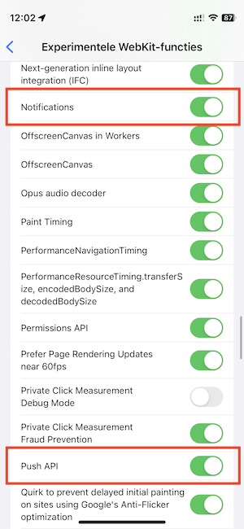

## Lets code!

For push notifications to work we need four important parts:

1. Service Worker

   We need a Service Worker to listen for push notifications. A Service Worker will always be active on the background of our device, while our Frontend Application only works when it is opened and active on screen. The Service Worker is in charge of listening for and showing notifications on the device.

2. Frontend Application

   The Frontend Application will be installed as a PWA on our device. When a notification pops up we can tap on it to open our application. The Frontend Application will activate the Service Worker and requests permission for receiving Notifications.

3. Backend Application

   The Backend Application receives notification subscriptions from the Frontend Application, stores them and is able to send push notifications to all subscribers.

4. Deployed to the cloud

   The application needs te be deployed on a server in order for push notifications to work on real mobile devices instead of only running it locally. We're going to use Azure Static Web Apps to build and deploy our app to the cloud.

To make our life easy we're going to use Next.js for this tutorial. Next.js is a great framework for having both a frontend and a backend together. It offers features such as Server Side Rendering, Static Site Generation and easy API creation. in this tutorial we'll be using the new [App Router](https://nextjs.org/docs/app/building-your-application/routing) to its full extend!

## Setup Next.js App

Lets start by creating a new Next.js app! Open your favorite Terminal and execute the following:

```sh
npm install --global yarn
yarn create next-app
```

It will ask you a couple of questions to configure your app. In this tutorial we will use TypeScript with ESLint.

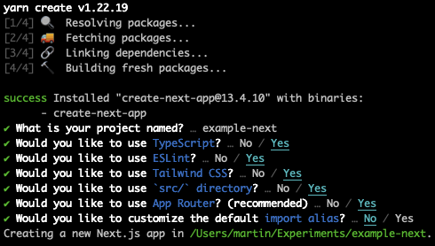

Wait for the installation to finish and go the folder where you app is created in. This depends on the project name you've chosen.

To abstract away some of the WebPush APIs we are going to use the `web-push` library. Install it as follows:

```sh
yarn add web-push
```

## Implement Service Worker

We need to start implementing the Service Worker first as the rest of our application relies on it. The Service Worker will inform our Backend Application about our new Notification Subscription. It also listens for new Notifications and shows them on our device when they come in.

Start by creating a new `service.js` file in the `public` folder.

### On Push

The Service Worker is responsible for listening to push events from the server and displaying the notification. For this we need to listen for the `push` event. Lets create an event listener for this:

```js
self.addEventListener('push', async (event) => {
  if (event.data) {
    const eventData = await event.data.json()
    showLocalNotification(eventData.title, eventData.body, self.registration)
  }
})

const showLocalNotification = (title, body, swRegistration) => {
  swRegistration.showNotification(title, {
    body,
    icon: '/icons/icon-192.png',
  })
}
```

The first part of this codeblock is to listen for the `push` event. Everytime a push event is coming in it will extract the event data (`await event.data.json()`) and calls the `showLocalNotification` function defined below.

For the `showLocalNotification` function we need a `title`, `body` and the `swRegistration` (Service Worker Registration) to be able to show the notification on the device. We can also provice an icon to show in the notification. In this case we use the app icon. By calling the `showNotification` method on the Service Worker Registration we show the notification on the screen of the receiving device:

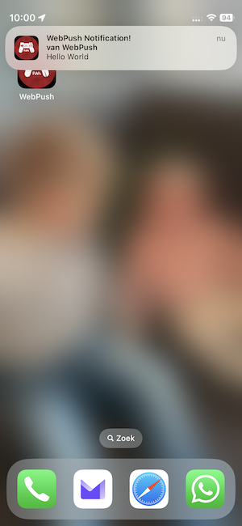

That's all we need for the Service Worker. Quite simple right? Lets move on to the next part!

## Implement Frontend

Now we can work on the Frontend of our app. This is the part the user will see and interact with. At this point we only have an empty Next.js app. Lets start by creating a new component.

### Setup component

We're going to create a new folder in `./src/app` called `components`. Next we create a new file `notifications.tsx` inside the newly created folder. You should now have an empty `.tsx` file in `./src/app/components/notifications.tsx`.

In this file we will first setup our new `Notifications` component:

```tsx
'use client'

export default function Notifications() {
  return <h3>WebPush PWA</h3>
}
```

The first line `use client` lets Next.js know that this component needs to be rendered client side instead of server side. We need this to be able to use a couple of browser APIs for Notifications. For now we only show a `h3` heading.

### Register Service Worker

The next step is to define a function to register the Service Worker:

```ts
const registerServiceWorker = async () => {
  return navigator.serviceWorker.register('/service.js')
}
```

This function registers the service worker we created earlier. It "connects" our frontend to the Service Worker and after calling it we can communicate with it.

### Save Subscription

To be able to receive notifications later on we need to "subscribe" to them. Lets create a dedicated function to send the subscription to our backend. The backend part we will implement at a later moment in this tutorial.

```ts
const saveSubscription = async (subscription: PushSubscription) => {
  const ORIGIN = window.location.origin
  const BACKEND_URL = `${ORIGIN}/api/push`

  const response = await fetch(BACKEND_URL, {
    method: 'POST',
    headers: {
      'Content-Type': 'application/json',
    },
    body: JSON.stringify(subscription),
  })
  return response.json()
}
```

The `saveSubscription` function takes the `subscription` and `POST`-s it to our backend. You can see in the code example that we expect to have an endpoint called `/api/push` to exist. We will create this later. The `subscription` is converted to JSON by using `JSON.stringify` function.

### Setup config file

Because WebPush uses encryption to send and receive messages we have to generate a private and public key for them to work. As mentioned earlier we use the `web-push` library to help us sending and receiving messages. We can use that library to generate a private and public key for us by running the command:

```sh
npx web-push generate-vapid-keys
```

This will result in something like this:

```sh
=======================================

Public Key:
BKA8Tv4SCygZtL9oHVZXCsVsb_k2RGnfzZ820f_m4F0GovyhG3UigN9mfmrpXxV6yRWrGNBqt2Ko7o__GF3kly8

Private Key:
m_mhR0RrCeWKZYkIlg_MJk_sEszpDK9EhqPXzTrQ7To

=======================================
```

Lets create a config file for storing these values and keep things organised. Create a `config.ts` file within the `./src` directory:

```ts
export const CONFIG = {
  PUBLIC_KEY:
    'BKA8Tv4SCygZtL9oHVZXCsVsb_k2RGnfzZ820f_m4F0GovyhG3UigN9mfmrpXxV6yRWrGNBqt2Ko7o__GF3kly8',
  PRIVATE_KEY: 'm_mhR0RrCeWKZYkIlg_MJk_sEszpDK9EhqPXzTrQ7To',
}
```

Feel free to use the keys for experimenting but for security reasons please generate your own keys instead!
Also it's highly recommended to store these keys in environment variables instead of in the app itself. You don't want to expose the private key to the public. For demonstrating purposes we will keep them directly in the app for now.

If you want to learn more about how Web Push encryption works I can recommend this article from Matt Gaunt: [The Web Push Protocol](https://web.dev/push-notifications-web-push-protocol/).

### Setup function

Now we are ready to combine the earlier steps! In our `notifications.tsx` file we're going to create a `setup` function to register the Service Worker, subscribe to notifications and send the subscription to our backend:

```ts
import { CONFIG } from '@/config'

const setup = async () => {
  const swRegistration = await registerServiceWorker()
  await Notification.requestPermission()

  try {
    const applicationServerKey = urlB64ToUint8Array(CONFIG.PUBLIC_KEY)
    const options = { applicationServerKey, userVisibleOnly: true }
    const subscription = await swRegistration.pushManager.subscribe(options)

    await saveSubscription(subscription)

    console.log({ subscription })
  } catch (err) {
    console.error('Error', err)
  }
}

// encode the base64 public key to Array buffer
const urlB64ToUint8Array = (base64String: string) => {
  const padding = '='.repeat((4 - (base64String.length % 4)) % 4)
  const base64 = (base64String + padding).replace(/\-/g, '+').replace(/_/g, '/')
  const rawData = atob(base64)
  const outputArray = new Uint8Array(rawData.length)
  for (let i = 0; i < rawData.length; ++i) {
    outputArray[i] = rawData.charCodeAt(i)
  }
  return outputArray
}
```

First we register the Service Worker by calling the function we've created earlier. Then we use the `requestPermission` method on the browser `Notification` API to request the user permission to send notifications:

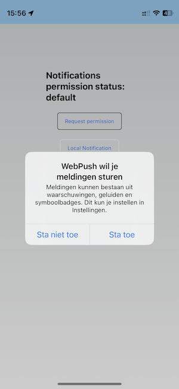

Then we grab our public key from the config file we've created earlier and converting it to an Array Buffer by using the `urlB64ToUint8Array` helper function. Followed by creating the subscription by using the `PushManager` API in the webbrowser: `swRegistration.pushManager.subscribe(...)`.

The last step is then to save the subscription to the backend by calling the `saveSubscription` function with our newly created subscription.

### Finishing component

Now we're ready to finish our Notifications component by calling the `setup` function when the component is loaded. We use the `useEffect` hook from React to do this. First we need to import this. Add the following line to the top of `notifications.tsx`:

```ts
import { useEffect } from 'react'
```

Then we add the effect to our component:

```ts
export default function Notifications() {
  useEffect(() => {
    setup()
  }, [])

  // ...
}
```

At this point your `Notifications.tsx` file should look like this:

```tsx
'use client'

import { useEffect } from 'react'
import { CONFIG } from '@/config'

export default function Notifications() {
  useEffect(() => {
    setup()
  }, [])

  return <h3>WebPush PWA</h3>
}

const registerServiceWorker = async () => {
  return navigator.serviceWorker.register('/service.js')
}

const setup = async () => {
  const swRegistration = await registerServiceWorker()
  await Notification.requestPermission()

  try {
    const applicationServerKey = urlB64ToUint8Array(CONFIG.PUBLIC_KEY)
    const options = { applicationServerKey, userVisibleOnly: true }
    const subscription = await swRegistration.pushManager.subscribe(options)

    await saveSubscription(subscription)

    console.log({ subscription })
  } catch (err) {
    console.error('Error', err)
  }
}

// encode the base64 public key to Array buffer
const urlB64ToUint8Array = (base64String: string) => {
  const padding = '='.repeat((4 - (base64String.length % 4)) % 4)
  const base64 = (base64String + padding).replace(/\-/g, '+').replace(/_/g, '/')
  const rawData = atob(base64)
  const outputArray = new Uint8Array(rawData.length)
  for (let i = 0; i < rawData.length; ++i) {
    outputArray[i] = rawData.charCodeAt(i)
  }
  return outputArray
}

const saveSubscription = async (subscription: PushSubscription) => {
  const ORIGIN = window.location.origin
  const BACKEND_URL = `${ORIGIN}/api/push`

  const response = await fetch(BACKEND_URL, {
    method: 'POST',
    headers: {
      'Content-Type': 'application/json',
    },
    body: JSON.stringify(subscription),
  })
  return response.json()
}
```

Please note that for simplicity we call the `setup` function every time the component is loaded. This is also executed whenever the page is refreshed. It speaks for itself that his is not the most ideal solution but it's simpler in the scope of this tutorial.

### Show Notifications component

We now can import our Notifications component in the entrypoint of our app. Open the file `./src/page.tsx` and replace its contents with the following:

```tsx
import dynamic from 'next/dynamic'

const Notifications = dynamic(() => import('@/app/components/notifications'), {
  ssr: false, // Make sure to render component client side to access window and Notification APIs
})

export default function Home() {
  return <Notifications />
}
```

By default Next.js tries to render components on the server. We use a dynamic import with the option `ssr: false` to make sure that Next.js renders the component on the client because we want to access the browser APIs.

### Setup manifest

The last step required to finish our frontend app is to make it a valid PWA. We need to setup the app manifest for this. We create a new file `manifest.json` in the `public` folder. This file contains information about our app and allows it to be "installed" on our mobile devices. Lets go ahead and put the following JSON into the `manifest.json` file:

```json
{
  "name": "WebPush with Next.js",
  "short_name": "WebPush",
  "start_url": ".",
  "display": "standalone",
  "theme_color": "#B12A34",
  "background_color": "#B12A34",
  "description": "Example PWA with WebPush!",
  "icons": [
    {
      "src": "icons/icon-32.png",
      "sizes": "32x32",
      "type": "image/png"
    },
    {
      "src": "icons/icon-64.png",
      "sizes": "64x64",
      "type": "image/png"
    },
    {
      "src": "icons/icon-96.png",
      "sizes": "96x96",
      "type": "image/png"
    },
    {
      "src": "icons/icon-128.png",
      "sizes": "128x128",
      "type": "image/png"
    },
    {
      "src": "icons/icon-168.png",
      "sizes": "168x168",
      "type": "image/png"
    },
    {
      "src": "icons/icon-192.png",
      "sizes": "192x192",
      "type": "image/png"
    },
    {
      "src": "icons/icon-256.png",
      "sizes": "256x256",
      "type": "image/png"
    },
    {
      "src": "icons/icon-512.png",
      "sizes": "512x512",
      "type": "image/png"
    }
  ],
  "related_applications": []
}
```

Please note that you will also need to create an icon for your app. An option is to use a website to generate those easily. For example: https://www.pwabuilder.com/imageGenerator. The generated icons then need to be put into the `./public/icons` folder.

Now we need to link our `manifest.json` file to our Next.js app. Put the following code in `./src/app/layout.tsx`:

```tsx
export const metadata = {
  title: ' WebPush Tutorial',
  description: 'Native Apps Are Dead - WebPush on iOS with Next.js!',
}

export default function RootLayout({
  children,
}: {
  children: React.ReactNode
}) {
  return (
    <html lang="en">
      <head>
        <link rel="manifest" href="/manifest.json" />
        <meta name="theme-color" content="#90cdf4" />
      </head>
      <body>
        <main>{children}</main>
      </body>
    </html>
  )
}
```

## Implement Backend

The last part we need to implement is our backend. We're going to create two endpoints:

1. `POST /api/push` -> save our subscription
2. `GET /api/push` -> send a notification to all subscribers

Start by creating a new folder `api` inside `./src/app`. And create a new folder inside `api` called `push`. Inside the `push` folder create a new file `route.ts`. You should now have the following: `./src/app/api/push/route.ts`.

The `route.ts` file is automatically mapped to the `/api/push` route. To create the `POST` route we need to define a function named `POST` in this `route.ts` file:

```ts
export async function POST(request: NextRequest) {
  // this gets executed whenever a POST request is made to /api/push
}
```

The same goes for our `GET` route:

```ts
export async function GET(request: NextRequest) {
  // this gets executed whenever a GET request is made to /api/push
}
```

### Save subscription

In our `POST` function we want to store the submitted Subscription we implemented earlier in our frontend. Normally we would use a database to store the subscriptions. But to keep things simple in this tutorial we will fake this and save the subscriptions in memory. Lets create a small in-memory database for this.

Make a new folder called `utils` inside the `./src` directory. Inside the `utils` folder create a file `in-memory-db.ts`. Put the following code inside this file:

```ts
import { PushSubscription } from 'web-push'

type DummyDb = {
  subscriptions: PushSubscription[]
}

export const dummyDb: DummyDb = { subscriptions: [] }

// fake Promise to simulate async call
export const saveSubscriptionToDb = async (
  subscription: PushSubscription
): Promise<DummyDb> => {
  dummyDb.subscriptions.push(subscription)
  return Promise.resolve(dummyDb)
}

export const getSubscriptionsFromDb = () => {
  return Promise.resolve(dummyDb.subscriptions)
}
```

We've created a variable called `dummyDb` which will be used to store the subscriptions in. The `saveSubscriptionToDb` function will add the provided subscription to the `dummyDb.subscriptions` array.

The function `getSubscriptionsFromDb` will be used to retrieve all subscriptions from memory to be able to send a notification to each subscriber later on.

With the in-memory database created we can finish our `POST` route. Put the following code inside `./src/app/api/push/route.ts`:

```ts
import { NextResponse, NextRequest } from 'next/server'
import webpush, { PushSubscription } from 'web-push'
import { CONFIG } from '@/config'
import {
  getSubscriptionsFromDb,
  saveSubscriptionToDb,
} from '@/utils/db/in-memory-db'

webpush.setVapidDetails(
  'mailto:test@example.com',
  CONFIG.PUBLIC_KEY,
  CONFIG.PRIVATE_KEY
)

export async function POST(request: NextRequest) {
  const subscription = (await request.json()) as PushSubscription | null

  if (!subscription) {
    console.error('No subscription was provided!')
    return
  }

  const updatedDb = await saveSubscriptionToDb(subscription)

  return NextResponse.json({ message: 'success', updatedDb })
}
```

We import all the required types from `next/server`, the `web-push` APIs, our `CONFIG` with the private and public keys in it and our newly created `in-memory-db`.
Next we use the `webpush.setVapidDetails` API to setup the `web-push` library correctly. This allows us to send messages later on.

Then inside our `POST` function we grab the `subscription` from the request. When calling `request.json()` we read the JSON contents from the request body. When there is a subsciption inside the request body we call the `saveSubscriptionToDb` function to save it into the database.

Lastly we `return NextResponse.json(...)` to give ourselves some feedback on the save operation. When we go to the URL of this api route you should see the success message and the `updatedDb` state.

### Send notifications

Below the `POST` function in `./src/app/api/push/route.ts` we will add the `GET` function:

```ts
export async function GET(_: NextRequest) {
  const subscriptions = await getSubscriptionsFromDb()

  subscriptions.forEach((s) => {
    const payload = JSON.stringify({
      title: 'WebPush Notification!',
      body: 'Hello World',
    })
    webpush.sendNotification(s, payload)
  })

  return NextResponse.json({
    message: `${subscriptions.length} messages sent!`,
  })
}
```

This fuction reads all subscriptions from the database by using the `getSubscriptionsFromDb` function we created earlier. After that it loops through the subscriptions by using a `forEach`. And it calls the `webpush.sendNotification` API for each subscriber to send the notifition.

Lastly we also return a JSON response to let ourselves know how many messages were sent.

## Local test

Our app should now be ready to go! Lets test it first locally on our machine to be sure. Start the app locally by running in your terminal:

```sh
yarn dev
```

This should return something like:

```sh
$ next dev
- ready started server on 0.0.0.0:3000, url: http://localhost:3000
```

If we now open http://localhost:3000 in our browser we should see our frontend running! Because our setup function is automatically executed when the page loads it should ask you for permission to show notifications when you open the frontend for the first time. Approve them to be able to receive notifications.

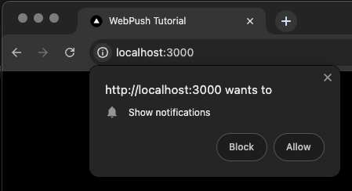

Next we visit our push api endpoint by going to http://localhost:3000/api/push in the browser. If you did everything correctly it should now send you a notification!


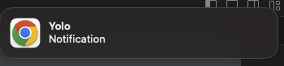

When you don't get the notification make sure that you've enabled notifications for your web browser in your Windows / MacOS notification settings. Also check if you've given the notifications permissions to the browser by clicking on the website settings:

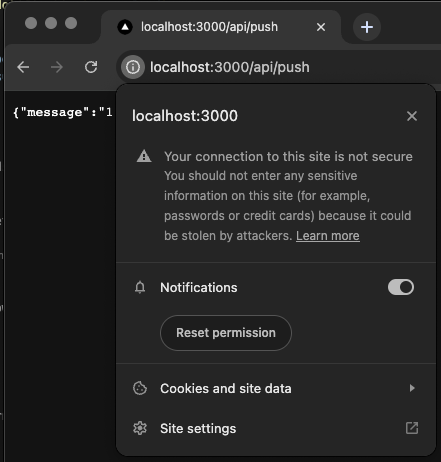

## Deploy to Azure

To fully test our app it needs to be deployed to a server. One of the options is to use Azure Static Web Apps for this. It's very easy to setup and works nicely together with Github. First start by [creating a new Github Repository](https://docs.github.com/en/repositories/creating-and-managing-repositories/creating-a-new-repository). Make sure that your project is committed and pushed to the repository. Preferrably on the `main` branch.

I would highly recommend to use the `standalone` [build option for Next.js](https://nextjs.org/docs/pages/api-reference/next-config-js/output#automatically-copying-traced-files) because without it could trigger some errors during the Azure deployement. Make sure to set `output: 'standalone'` in `./next.config.js`.

Next [create a free Azure account](https://azure.microsoft.com/en-us/free) if you don't have one yet and login. We will use the free tier so no need to add credit card information :-).

Now click on `Create Resource`:

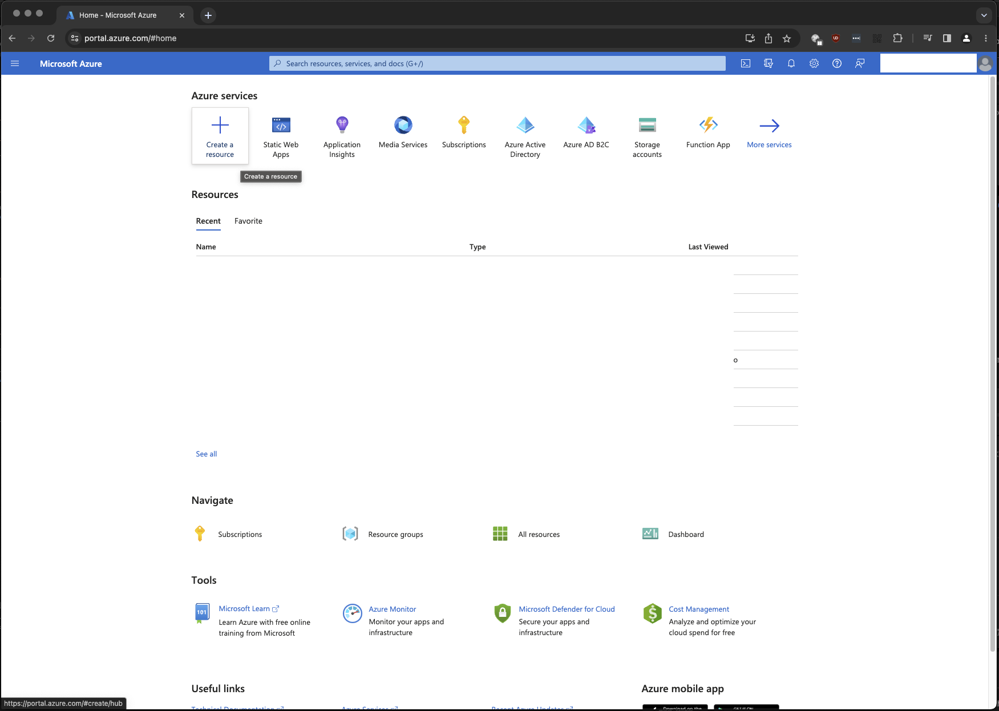

Search for `Static Web Apps` and click on `Create` -> `Static Web App`:

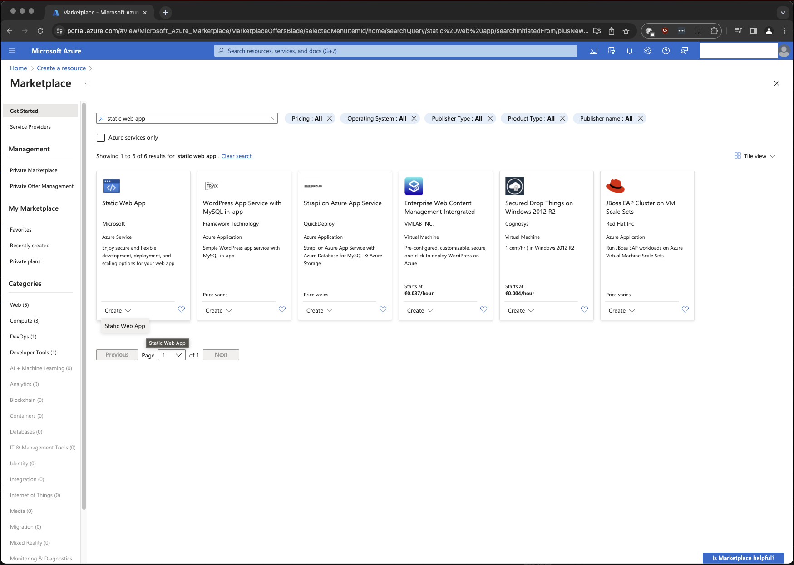

You'll get a form where you need to choose the correct `Subscription` and `Resource Group`. You might need to create them when you just registered for a new account.
Further down choose a name and Region for your app.

Under `Deployment details` choose for `Github`, authorize Azure to access your Github account and choose the correct Github Organization, Repository and Branch for your app.

Under `Build details` choose `Next.js` as `Build preset`. Leave the rest of the fields as-is.

Lastly click `Review + create`.


Then click `Create` on the review screen:

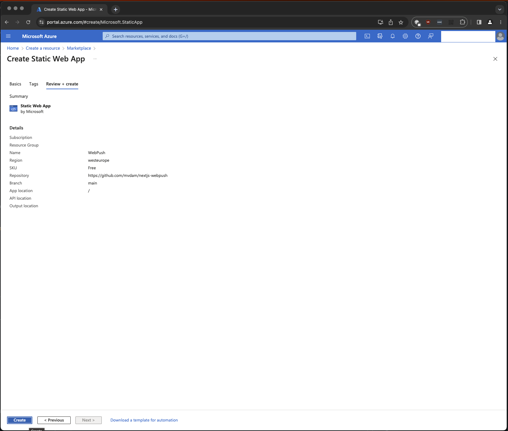

This starts the deployment of your app:

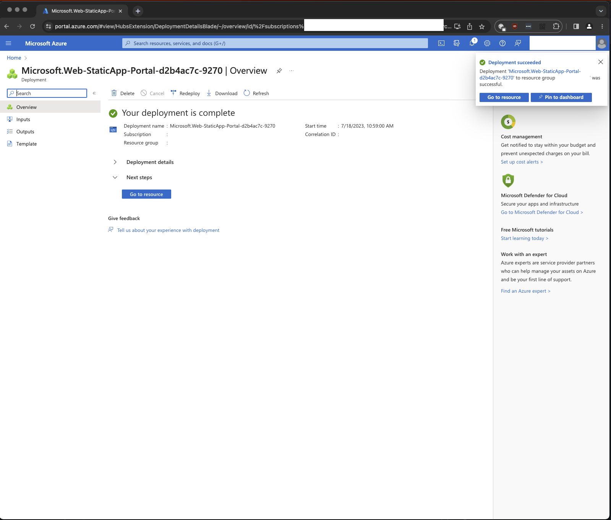

Click on `Go to resource` when the deployment is complete:

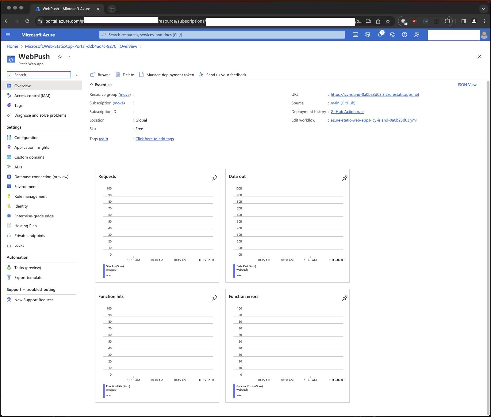

Here you have an overview of your app. Click on the URL on the top right to view your deployed app! It can sometimes take a little while before it is fully available.

The example app I've created for this article is available on https://icy-island-0a0b23d03.3.azurestaticapps.net/ ->

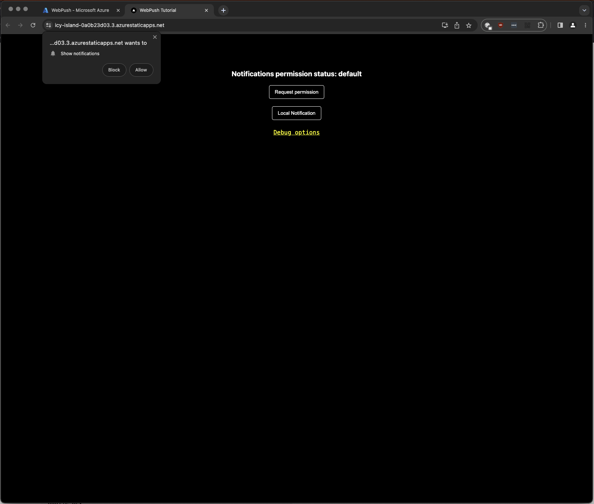

It has some extra functionality to debug the app and reset the Service Workers.

When you allow notifications and go to our push endpoint: https://icy-island-0a0b23d03.3.azurestaticapps.net/api/push you should get a notification right away!

### Github Actions

If you followed the previous steps and your app is successfull deployed to Azure you will notice that there is something changed on your GitHub repository. Azure has created a new Github Action for your app automatically. Look for the `.github/workflows/` folder and you see a new `*.yml` file. This is the configuration to build and deploy your app on Azure.

You can find the workflow file for the example project [here](https://github.com/mvdam/nextjs-webpush/blob/main/.github/workflows/azure-static-web-apps-icy-island-0a0b23d03.yml).

## Install our PWA on iOS

To finish the whole loop we need to open our app on an iOS or Android device. Open https://icy-island-0a0b23d03.3.azurestaticapps.net/ on your phone and make sure to install it / Add to Home Screen:

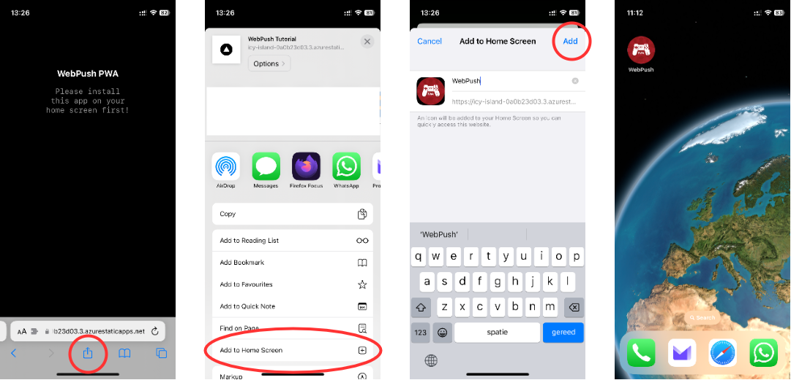

Your app is now installed and added to your Home Screen:

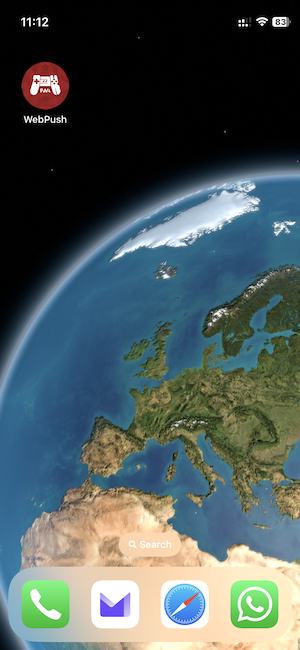

Then lets open it and press `Request permission`:

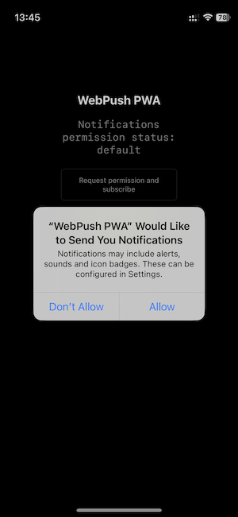

Now close the app and go to our push endpoint again onm your laptop / PC: https://icy-island-0a0b23d03.3.azurestaticapps.net/api/push.

If everything went well you now received a WebPush message on your phone!

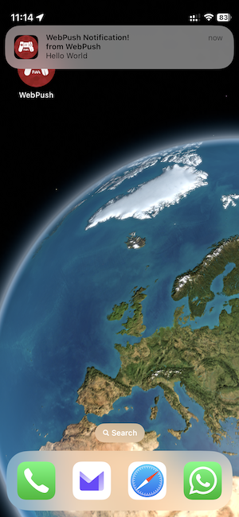

Because an Azure Static Web App shuts down after some time of inactivity it will also erase our in-memory database. When you visit the app URL it will start your app again with an empty database. You might have to re-install the app to receive notifications again. You'll see that our in-memory database implementation is not ideal ;-).

## Summary

Respect for making it all the way to the end! You've now learned the basics of setting up a fresh Next.js app with multiplatform push notifications for PWA's. I hope you've found it useful and it can help you with future projects!

It's great to have the possibility for push notifications on iOS, Android, Windows, MacOS and Linux by only using modern web APIs!

Thanks for reading and until the next one! Please reach out for questions or feedback! Feel free to use my example project on https://github.com/mvdam/nextjs-webpush.

## Used resources:

- https://en.wikipedia.org/wiki/Progressive_web_app
- https://learn.microsoft.com/en-us/azure/static-web-apps/deploy-nextjs-hybrid
- https://web.dev/push-notifications-web-push-protocol/

## Image inspiration

https://unsplash.com/s/photos/notification

## Example project Github

https://github.com/mvdam/nextjs-webpush
